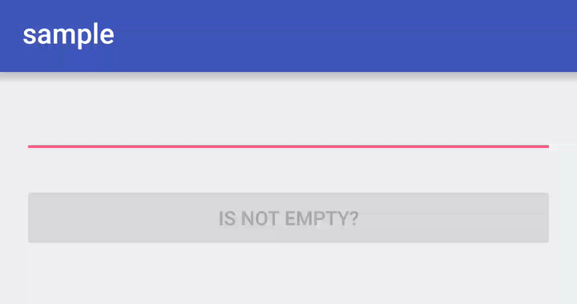

# RxProperty Android

Bindable and observable property for Android Data Binding

This library is an Android port of [ReactiveProperty](https://github.com/runceel/ReactiveProperty).




## Download

```groovy
repositories {
    maven { url "https://jitpack.io" }
}

dependencies {
    compile 'com.github.k-kagurazaka.rx-property-android:rx-property:3.0.0'

    // If you want to use Kotlin syntax
    compile 'com.github.k-kagurazaka.rx-property-android:rx-property-kotlin:3.0.0'
}
```


## Basics Usage

First, declare a view model class with `RxProperty` and `RxCommand`.

`RxProperty` represents a variable of a view state and `RxCommand` represents a command of "Command Pattern",
which is abstraction of user manipulation.

```java
public class ViewModel {
  public final RxProperty<String> input;
  public final ReadOnlyRxProperty<String> output;
  public final RxCommand<Nothing> command;

  public JavaViewModel() {
    input = new RxProperty<>("")
        .setValidator(it -> TextUtils.isEmpty(it) ? "Text must not be empty!" : null);

    output = new RxProperty<>(
        input.map(it -> it == null ? "" : it.toUpperCase())
    );

    command = new RxCommand<>(input.onHasErrorsChanged().map(it -> !it));
    command.subscribe(it -> { input.set("clicked!"); });
  }
```

Next, write a layout XML to bind the view model.
Both one-way (by `@{}`) and two-way (by `@={}`) binding are supported.

```xml
<layout xmlns:android="http://schemas.android.com/apk/res/android"
    xmlns:app="http://schemas.android.com/apk/res-auto">
    <data>
        <variable name="viewModel" type="ViewModel" />
    </data>

    <LinearLayout
        android:layout_width="match_parent"
        android:layout_height="match_parent"
        android:orientation="vertical">

        <EditText
            android:layout_width="match_parent"
            android:layout_height="wrap_content"
            android:inputType="text"
            android:text="@={viewModel.input.value}" />

        <TextView
            android:layout_width="match_parent"
            android:layout_height="wrap_content"
            android:text="@{viewModel.output.value}" />

        <Button
            android:layout_width="match_parent"
            android:layout_height="wrap_content"
            android:text="Is not empty?"
            app:rxCommandOnClick="@{viewModel.command}" />
    </LinearLayout>
</layout>
```

Finally, execute data binding in your activity.

```java
  @Override
  protected void onCreate(Bundle savedInstanceState) {
    super.onCreate(savedInstanceState);
    ActivityMainBinding binding = DataBindingUtil.setContentView(this, R.layout.activity_main);
    binding.setViewModel(new ViewModel());
  }

```

You are done!

```
Important Note: These snippets skips resource management/error handling for simplicity.
```


## Validation

`RxProperty` provides validation. To use this feature, simply call `setValidator` method after `RxProperty` created.

```java
public final RxProperty<String> input = new RxProperty<>("")
        .setValidator(it -> TextUtils.isEmpty(it) ? "Text must not be empty!" : null);
```

`RxProperty` also supports error notification with `TextInputLayout`.

```xml
<android.support.design.widget.TextInputLayout
    android:layout_width="match_parent"
    android:layout_height="wrap_content"
    app:error="@{viewModel.input.error}"
    app:errorEnabled="@{viewModel.input.hasError}">

    <EditText
        android:layout_width="match_parent"
        android:layout_height="wrap_content"
        android:inputType="text"
        android:text="@={viewModel.input.value}"/>
</android.support.design.widget.TextInputLayout>
```


## `RxCommand` with Trigger

By default, the library provides the only `View#onClick` binder for `RxCommand`. If you want to bind `RxCommand` to others view events,
implement `BindingAdapter` for your desired events or use trigger binding.

`RxCommand` can be kicked by `Observable` by the `bindTrigger` method. [RxBinding](https://github.com/JakeWharton/RxBinding) is match for the use.

```java
// When the menu whose id is R.id.some_menu is selecetd, someMenuCommand executes
viewModel.someMenuCommand.bindTrigger(RxMenuItem.clicks(menu.findItem(R.id.some_menu)));
```


## Create from `android.databinding.Observable`

If you already have a `android.databinding.Observable` based view model, you can use a converter from the view model into `rx.Observable`.
The library provides a feature to convert from `rx.Observable` to `RxProperty`, so you easily create `RxProperty` from the view model.

```java
class Person extends BaseObservable { ... }

Person person = new Person("John", "Smith");
Observable<String> firstNameChanged = Observe.propertyOf(person, BR.firstName, it -> it.getFirstName());
RxProperty<String> firstName = new RxProperty<>(firstNameChanged, person.getFirstName());
```


## Kotlin Support

There are some useful extension methods in `rx-property-kotlin'.

```kotlin
class Person : BaseObservable { ... }

class ViewModel {
    val input = RxProperty("")
            .setValidator { if (TextUtils.isEmpty(it)) "Text must not be empty!" else null }

    val output = input.map { it?.toUpperCase() ?: "" }
            .toReadOnlyRxProperty()

    val command = input.onHasErrorsChanged()
            .map { !it }
            .toRxCommand<Nothing>()

    val person = Person("John", "Smith")
    val firstName = person.observeProperty(BR.firstName) { it.firstName }
            .toRxProperty()

    init {
        command.subscribe { input.set("clicked!") }
    }
}
```


## License

    The MIT License (MIT)

    Copyright (c) 2016 Keita Kagurazaka

    Permission is hereby granted, free of charge, to any person obtaining a copy
    of this software and associated documentation files (the "Software"), to deal
    in the Software without restriction, including without limitation the rights
    to use, copy, modify, merge, publish, distribute, sublicense, and/or sell
    copies of the Software, and to permit persons to whom the Software is
    furnished to do so, subject to the following conditions:

    The above copyright notice and this permission notice shall be included in all
    copies or substantial portions of the Software.

    THE SOFTWARE IS PROVIDED "AS IS", WITHOUT WARRANTY OF ANY KIND, EXPRESS OR
    IMPLIED, INCLUDING BUT NOT LIMITED TO THE WARRANTIES OF MERCHANTABILITY,
    FITNESS FOR A PARTICULAR PURPOSE AND NONINFRINGEMENT. IN NO EVENT SHALL THE
    AUTHORS OR COPYRIGHT HOLDERS BE LIABLE FOR ANY CLAIM, DAMAGES OR OTHER
    LIABILITY, WHETHER IN AN ACTION OF CONTRACT, TORT OR OTHERWISE, ARISING FROM,
    OUT OF OR IN CONNECTION WITH THE SOFTWARE OR THE USE OR OTHER DEALINGS IN THE
    SOFTWARE.
